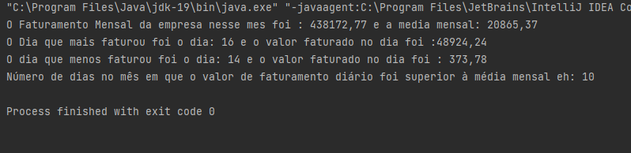
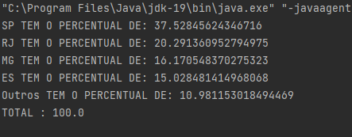
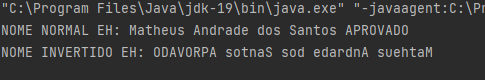

# Teste-TargetSistemas

#Atividades realizadas em java para o processo seletivo para vaga de desenvolvedor na empresa Target Sistemas!

  <h4>Atividade 2 resultados</h4>
  

  <h4>Atividade 3 resultados</h4>
  

  <h4>Atividade 4 resultados</h4>
  

  <h4>Atividade 5 resultados</h4>
  

